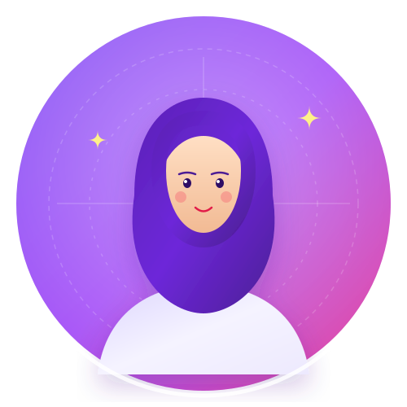
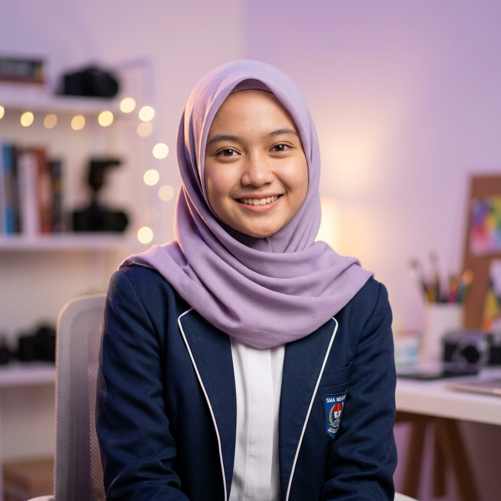

# Portfolio Personal - Ayunda Nila Novitasari

Website personal portfolio modern, bersih, elegan, dan responsif yang dirancang khusus untuk **Ayunda Nila Novitasari**, pelajar SMK Negeri Tembarak jurusan **Rekayasa Perangkat Lunak (RPL)**.

---

## 🌟 Fitur Utama Website

1. **Desain Modern & Berkarakter**:
   - Perpaduan estetika teknologi (RPL) dan seni tari (kreativitas).
   - Palet warna elegan: Ungu (*Primary*), Pink/Rose (*Accent*), dan Off-White yang bersih.
   - Tipografi kontemporer menggunakan font *Plus Jakarta Sans* & *Poppins*.

2. **Struktur Konten Lengkap & Akurat**:
   - **Navbar**: Sticky navbar dengan efek blur transparan dan menu hamburger mobile.
   - **Hero Section**: Sapaan personal, badge kejuruan RPL, dan visual profil modern.
   - **Tentang Saya**: Narasi pengenalan dan kartu informasi biodata pribadi.
   - **Pendidikan**: Timeline visual SMK Negeri Tembarak (RPL, Kelas 11, 2025 – Sekarang).
   - **Keahlian**: Kartu kompetensi *Kerja Sama Tim* beserta pilar komunikasi dan kontribusinya.
   - **Karakter & Kepribadian**: Nilai *Mandiri*, *Disiplin*, dan *Bertanggung Jawab*.
   - **Pengalaman**: Kartu rekam jejak *Lomba Pramuka 2023 (Tingkat/Cabang Daerah)*.
   - **Minat & Seni**: Section kreatif perpaduan tari, ketekunan, dan ekspresi diri.
   - **Kutipan (Quote)**: Kutipan motivasi belajar dan berkreasi.
   - **Kontak**: Placeholder siap-edit untuk Email, Instagram, WhatsApp, dan GitHub lengkap dengan notifikasi interaktif.
   - **Footer**: Hak cipta © 2026 dan tautan cepat.

3. **Interaktivitas & Kenyamanan Pengguna**:
   - *Scroll Reveal Animation* (muncul halus saat di-scroll).
   - *Active Scroll Spy Navigation* (penanda menu aktif otomatis).
   - Tombol *Back-to-Top* otomatis.
   - Sepenuhnya responsif untuk Desktop, Laptop, Tablet, dan Smartphone.

---

## 📁 Struktur Direktori

```
c:/ayundanila/
├── index.html                           # Struktur halaman utama (Semantic HTML5)
├── css/
│   └── style.css                        # Styling, CSS variables, layout Grid & Flexbox
├── js/
│   └── main.js                          # Logika interaktif & animasi DOM
├── assets/
│   └── images/
│       ├── profile-placeholder.svg      # Avatar SVG modern (dapat diganti foto asli)
│       └── art-dance-accent.svg         # Aksen ilustrasi tari & seni visual
└── README.md                            # Panduan penggunaan & dokumentasi
```

---

## 🚀 Cara Menjalankan Project

Website ini dibuat menggunakan teknologi web murni (**HTML5, CSS3, JavaScript**) sehingga sangat ringan dan tidak memerlukan instalasi dependensi rumit:

### Opsi 1: Menggunakan NPM / Vite (Direkomendasikan)
1. Buka terminal di folder project (`c:\ayundanila`).
2. Jalankan perintah:
   ```powershell
   npm run dev
   ```
   *(Catatan: Jika muncul pesan error tentang script disabled di PowerShell, jalankan `npm.cmd run dev` atau jalankan `Set-ExecutionPolicy -Scope CurrentUser -ExecutionPolicy RemoteSigned` sekali).*
3. Buka link yang muncul di terminal (biasanya `http://localhost:5173`) di browser.
4. Setiap perubahan pada file HTML, CSS, atau JS akan langsung terupdate otomatis (Hot Reload).

Untuk membuat bundle produksi yang sudah teroptimasi:
```powershell
npm run build
```

### Opsi 2: Menggunakan Live Server di VS Code
1. Buka folder `c:\ayundanila` menggunakan Visual Studio Code.
2. Pasang ekstensi **Live Server** (oleh Ritwick Dey) jika belum ada.
3. Klik kanan pada file `index.html` dan pilih **"Open with Live Server"** (atau tekan `Alt+L Alt+O`).

### Opsi 3: Langsung Buka di Browser
1. Buka File Explorer dan tuju ke folder `c:\ayundanila`.
2. Klik ganda pada file `index.html`.

---

## ✏️ Panduan Kustomisasi untuk Ayunda

### 1. Mengganti Foto Profil dengan Foto Asli
1. Siapkan foto Anda (format `.jpg` atau `.png`, disarankan rasio 1:1 / persegi).
2. Simpan foto tersebut di folder `assets/images/`, misalnya dengan nama `profile.jpg`.
3. Buka file `index.html`, cari baris berikut (sekitar baris 90):
   ```html
   
   ```
4. Ubah `src` menjadi:
   ```html
   
   ```

### 2. Memperbarui Informasi Kontak & Media Sosial
Buka file `index.html` pada bagian section `#kontak` (sekitar baris 370). Anda dapat mengubah tautan `href` sesuai akun Anda:
- **Email**: Ubah `href="#kontak"` menjadi `href="mailto:emailanda@gmail.com"`
- **WhatsApp**: Ubah `href="#kontak"` menjadi `href="https://wa.me/628xxxxxxxxxx"`
- **Instagram**: Ubah `href="#kontak"` menjadi `href="https://instagram.com/username_anda"`
- **GitHub**: Ubah `href="#kontak"` menjadi `href="https://github.com/username_anda"`

---

## 💡 Hak Cipta & Lisensi
Dibuat dengan dedikasi untuk **Ayunda Nila Novitasari** &copy; 2026.
Semua hak cipta dilindungi undang-undang.
